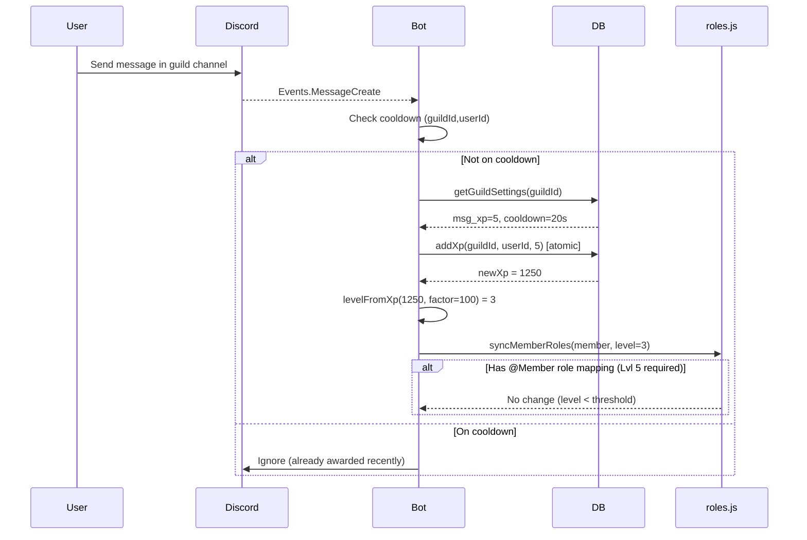

# Architecture Overview

Technical deep dive into Boiler Snake's architecture, for developers and contributors.

## Overview

Boiler Snake is a [Discord.js](https://discord.js.org/) v14 bot with SQLite database backend. The codebase emphasizes modularity, safety, and zero-dependency configuration for self-hosting.

---

## File Structure

```
src/
├── index.js              # Main entry point, event handlers, command router
├── db.js                 # SQLite wrapper + migrations + XP operations
├── xp.js                 # Level calculation utilities (formula: sqrt(xp/factor))
├── roles.js              # Role grant/drop logic with grace periods
├── reactionRoles.js      # Reaction-role panels (embed + emoji options)
├── auditLog.js           # Staff audit + message log embeds and message cache
├── voiceTicker.js        # Per-minute voice XP ticker
├── youtubeTicker.js      # YouTube channel monitoring & notifications
├── decay.js              # Daily cron job for XP decay scheduling
└── renderLeaderboard.js  # PNG generation for leaderboards

xpbot.sqlite            # SQLite database (created on first run)
package.json            # Dependencies and scripts
.env.example           # Environment variable template
```

---

## Core Modules

### `index.js` - Main Entry Point

**Responsibilities**:
- Discord client initialization with intents and partials
- Event handlers for:
  - `ClientReady`: Start tickers (voice, decay, YouTube)
  - `MessageCreate`: Cache for message log, honeypot enforcement, then message XP with cooldowns
  - `MessageReactionAdd`: Reaction-role panels first, then reaction XP
  - `MessageReactionRemove`: Drop removable reaction roles
  - `MessageDelete` / `MessageBulkDelete`: Message log channel embeds
  - `GuildBanAdd` / `GuildMemberRemove`: Audit log bans and kicks
  - `InteractionCreate`: Slash command routing

**Key Functions**:
```javascript
key(guildId, userId)           // Cooldown map key generator
handleHoneypotMessage(message) // Ban non-exempt posters in honeypot channels
isAdminOrMod(interaction)      // Permission check helper
commandsAllowed(interaction)   // Command channel restriction logic
validateXpValue(value, label)  // XP value validation (capped to 1B)
```

**Event Order**:
```javascript
// Tickers started on ready
startVoiceTicker(client);    // voiceTicker.js: runs every minute
startDecayScheduler(client); // decay.js: cron at 4 AM
startYoutubeTicker(client);  // youtubeTicker.js: poll RSS/API
```

---

### `db.js` - Database Layer

**SQLite Configuration**:
```javascript
const db = new Database(path.join(__dirname, "..", "xpbot.sqlite"));
db.pragma("journal_mode = WAL");  // Write-Ahead Logging for concurrency
```

**Safety Features**:
- JS-safe XP limit: `Number.MAX_SAFE_INTEGER` (9,007,199,254,740,991)
- Atomic transactions prevent race conditions
- Automatic clamping of Infinity/NaN/too large values

**Core Functions**:

| Function | Purpose |
|----------|---------|
| `addXp(guildId, userId, delta)` | Atomic XP addition with safe clamping |
| `getXp(guildId, userId)` | Get user's current XP (clamped on read) |
| `setXp(guildId, userId, xp)` | Direct XP assignment |
| `topUsers(guildId, limit)` | Top users by XP for leaderboard |
| `getGuildSettings(guildId)` | Get guild configuration |
| `updateGuildSettings(guildId, patch)` | Update guild config safely |
| `isHoneypotChannel(guildId, channelId)` | Whether a channel is a honeypot |
| `memberHasHoneypotExemptRole(...)` | Whether member roles include a honeypot exemption |

**Database Migrations**:
Applied on startup in `runMigrations()`:
1. Added `reaction_xp` + `reaction_cooldown_sec` columns
2. Recreated `youtube_channels` with composite primary key
3. Added `last_checked` column for YouTube channels
4. Cleanup malformed XP values (Infinity/NaN/>

Honeypot tables (`honeypot_channels`, `honeypot_exempt_roles`) and reaction-role tables (`reaction_role_panels`, `reaction_role_options`) are created via base schema `CREATE TABLE IF NOT EXISTS` on startup.

---

### `reactionRoles.js` - Reaction Role Panels

**Responsibilities**:
- Build and refresh bot-owned panel embeds
- Parse unicode/custom emoji keys for stable matching
- Grant roles on configured reactions when min level is met
- Strip unconfigured reactions on managed panels
- Remove roles on reaction remove when the option is `removable`
- `syncMemberReactionRoles`: after XP decay, strip reaction-claim roles below min level
- Posts audit-log embeds when roles actually change (via `auditLog.js`)

See [Reaction Roles](reaction-roles.md) for admin usage.

### `auditLog.js` - Staff Logs

**Responsibilities**:
- Resolve per-guild `audit_log_channel_id` / `message_log_channel_id`
- In-memory message content cache for verbose delete logs
- Embed builders + send helpers for deletes, bans, kicks, reaction roles, level-role changes
- Best-effort Discord audit-log lookup for executors (View Audit Log permission)

See [Audit Log & Message Log](audit-log.md).

---

### `xp.js` - Level Calculation

```javascript
function levelFromXp(xp, levelXpFactor) {
  const factor = Math.max(1, Number(levelXpFactor) || 100);
  return Math.floor(Math.sqrt(Math.max(0, xp) / factor));
}
```

**Simple but critical**: Used by:
- `/xp` and `/leaderboard` commands
- Auto-role granting in `roles.js`
- Decay calculations

---

### `roles.js` - Role Management

```javascript
async function syncMemberRoles(member, level) {
  // 1. Check all configured role→level mappings
  // 2. If user meets threshold: grant role (if not already granted)
  // 3. If user dropped below: start drop timer (only once)
  // 4. If grace period expired: revoke role
}
```

**State Tracking**:
- `level_roles`: Stores level requirements + grace days
- `role_drop_state`: Tracks when users first fell below threshold

---

### `voiceTicker.js` - Voice XP System

**TickerSchedule**: Runs every minute on minute boundaries (00, :01, :02...).

**Eligibility Logic**:
```javascript
if (!channelId) continue;                    // Must be in voice channel
if (isAfkChannel(channelId)) continue;       // Skip AFK channel
if (member.isBot()) continue;                // Bots excluded
if (isMutedOrDeafened(vs)) continue;         // Self or server mute/deafen
if (channelEligible.size < 2) continue;      // At least 2 eligible humans

addXp(guildId, member.id, xpPerMin);        // Award XP
```

**Initial Delay**: Calculates milliseconds to next minute:
```javascript
const msToNextMinute = 60000 - (Date.now() % 60000);
setTimeout(startVoiceTick, msToNextMinute);
setInterval(runVoiceTick, 60000);  // Then run every 60s
```

---

### `youtubeTicker.js` - YouTube Integration

**Hybrid Approach**: Uses both:
- **YouTube Data API v3**: For @username resolution and live stream detection
- **RSS parsing**: Fallback for video uploads

**API Endpoints**:
1. `/youtube/v3/search`: Resolve @username to channel ID
2. `/youtube/v3/channels`: Get uploads playlist ID  
3. `/youtube/v3/playlistItems`: Fetch recent videos

**Polling Flow**:
```javascript
for each subscribed channel {
  fetch uploads playlist items
  if (new video found && not already notified) {
    post to notification channel
    update last_video_id in DB
  }
}
```

---

### `decay.js` - XP Decay Scheduler

**Schedule**: Daily at 4:00 AM server local time (cron: `"0 4 * * *"`) using [node-cron](https://www.npmjs.com/package/node-cron).

**Algorithm**:
```javascript
for each user in guild {
  msgCount = countMessagesInWindow(guildId, userId, decay_window_days)
  
  if (msgCount < decay_min_messages) {
    newXp = Math.floor(user.xp * (1 - decay_percent))
    setXp(guildId, userId, newXp)
    
    // Re-sync roles in case level dropped
    syncMemberRoles(member, levelFromXp(newXp))
  }
}
```

---

### `renderLeaderboard.js` - PNG Generation

**Canvas Dimensions**: 900px × variable height (base 10 rows)

**Rendering Steps**:
1. Create canvas with gradient background (blue theme)
2. Draw header (title, separator line)
3. For each user (top 10):
   - Draw rank (trophy for top 3: 🥇🥈🥉)
   - Draw username
   - Draw XP bar gradient
   - Draw level underneath
4. Save as PNG buffer

**Font Stack**: Noto Sans → DejaVu Sans → system-ui with fallbacks

---

## Data Flow Examples

### Message XP Workflow



### Role Grant Workflow

```mermaid
sequenceDiagram
    participant User
    participant DB
    participant RolesModule
    participant DiscordAPI

    User->>DB: XP increases to 2500
    DB-->>RolesModule: levelFromXp(2500,100) = 5
    alt Has role mapping (role=@Member, required Lvl 5)
        RolesModule->>DiscordAPI: member.roles.add(@Member)
        DiscordAPI-->>RolesModule: Role added successfully
        
        RolesModule->>DB: setRoleBelowSince(NULL) [clear timer]
    else No mapping configured
        RolesModule-->>) No action
    end
```

### YouTube Notification Flow

```mermaid
sequenceDiagram
    participant YoutubeTicker
    participantYoutubeAPI
    participant DB
    participant DiscordAPI

    YoutubeTicker->>YouTubeAPI: Search @SomeChannel
    YouTubeAPI-->>YoutubeTicker: Channel ID = UCxxxxx
    
    YoutubeTicker->>DB: addYoutubeChannel(guildId, "UCxxxxx", ...)
    DB-->>YoutubeTicker: Subscription saved
    
    loop Every 5 minutes (polling)
        YoutubeTicker->>YouTubeAPI: PlaylistItems uploads playlist
        YouTubeAPI-->>YoutubeTicker: [video1, video2]
        
        alt video1.id != last_video_id
            YoutubeTicker->>DiscordAPI: POST /channels/xxx/messages
            DiscordAPI-->>YoutubeTicker: Message ID
            
            YoutubeTicker->>DB: update last_video_id="v1"
        else Already notified
            YoutubeTicker-->>) Skip
        end
    end
```

---

## Configuration Flow

### Environment Variables → Guild Settings

```javascript
// .env file
DISCORD_TOKEN=...         // Used by index.js to login
CLIENT_ID=...             // Used for slash command registration

// On first getGuildSettings() call:
db.prepare(`INSERT INTO guild_settings ... VALUES (?, 5, 2, 1, ...)`)
```

### Command Configuration → Database

```javascript
// /setxp message:10 reaction:2
client.on("InteractionCreate", async (interaction) => {
  const msg = interaction.options.getInteger("message"); // 10
  
  updateGuildSettings(guildId, { 
    msg_xp: 10,
    reaction_xp: 2 
  });
  
  // DB UPDATE statement applied
});
```

---

## Error Handling Strategy

### Cooldown Violation (Silent)
```javascript
const nowMs = Date.now();
if ((nowMs - last) < cdSec * 1000) return;  // No error thrown
```

### Permission Denied (Ephemeral Response)
```javascript
if (!admin) {
  await interaction.reply({ 
    content: "You don't have permission", 
    flags: MessageFlags.Ephemeral 
  });
}
```

### Database Migration Failures
- Migrations wrapped in IIFE (immediately invoked function expression)
- Errors logged to console but don't crash startup

### YouTube API Rate Limits
- Capped at `MAX_XP_AWARD = 1_000_000_000` per event
- Cooldowns prevent spam-farming regardless of external APIs

---

## Security Considerations

### XP Clamping (Prevents Overflow)
```javascript
function clampXpTotal(n) {
  const x = Number(n);
  if (!Number.isFinite(x)) return MAX_SAFE_XP;  // Infinity/NaN → max
  if (x <= 0) return 0;                         // Negative → 0
  return Math.min(Math.floor(x), MAX_SAFE_XP);  // Too large → cap
}
```

### Command Injection Prevention
- All user input sanitized via Discord.js options validation
- SQL parameters use prepared statements
- No eval() or direct string concatenation in queries

### Cooldown Cache Sweep
```javascript
// Avoid unbounded memory growth
setInterval(() => {
  sweepCooldownMap(msgCooldown, 6 * 60 * 60 * 1000); // 6 hours window
}, 10 * 60 * 1000);  // Every 10 minutes
```

---

## Performance Optimizations

### In-Memory Cooldowns vs Database
- Cooldowns stored in `Map` (not database) for speed
- Sweep interval clears old entries to prevent memory leaks
- 6-hour window sufficient for cooldown periods (seconds/minutes)

### Batch Member Fetches
```javascript
// Instead of individual fetch per user:
const members = await guild.members.fetch({ 
  user: rows.map(r => r.user_id) 
});
```

### Database Indices
```sql
CREATE INDEX idx_activity_recent 
ON activity_log (guild_id, user_id, kind, created_at);

-- Decay queries use this index efficiently
```

---

## Testing approach

Since this is primarily a Discord bot integrated with external APIs:

1. **Unit Tests**: Can test `xp.js`, `db.js` helper functions
2. **Integration Tests**: Hard (requires live Discord API credentials)
3. **Manual Testing**:
   - Start bot with test server
   - Send messages, react, join voice
   - Verify `/xp` and `/leaderboard` output

---

## Known Limitations

- No multi-threading (Node.js single-threaded event loop)
- Activity logs grow indefinitely (no auto-purge)
- Leaderboard renders only top 10 (even if queried for more)
- YouTube notifications use both RSS + Data API (potential duplicates)

---

## Future Architecture Ideas

### Plugin System
Allow custom XP sources:
```javascript
bot.registerXpSource({
  name: 'custom',
  handler: async (message) => { ... }
});
```

### Analytics Dashboard
External web UI for statistics without admin commands.

### Redis Cache Layer
Offload cooldown tracking from memory to Redis for distributed setups.
