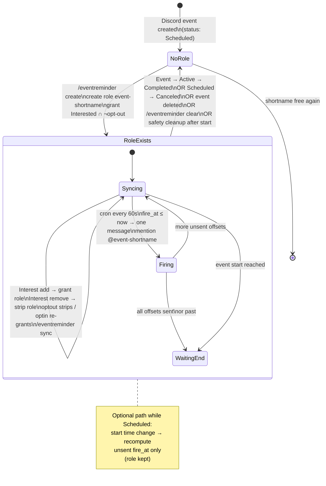
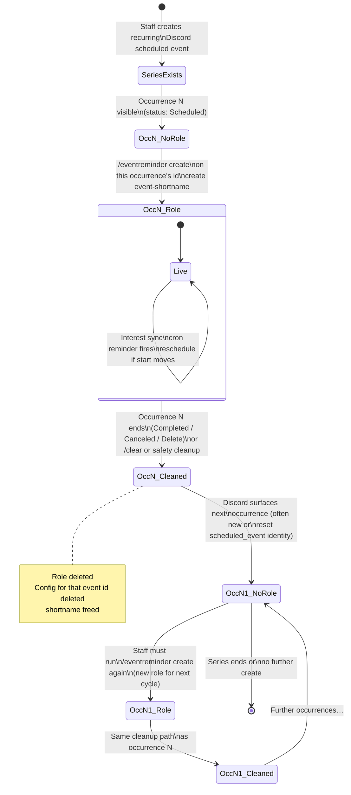
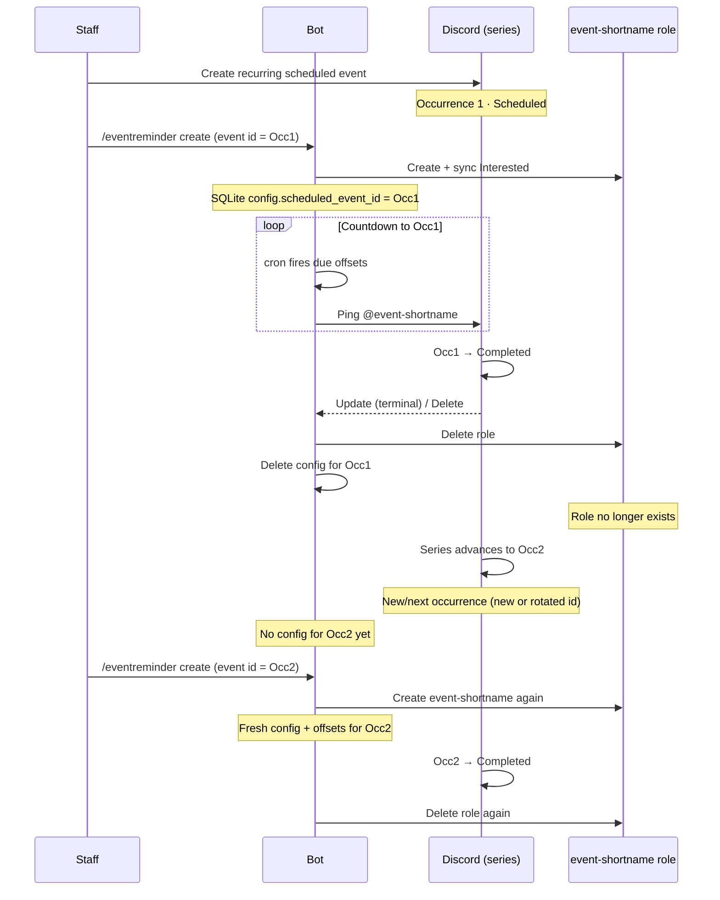

# Scheduled Event Reminders

Pre-event reminder pings for Discord **Guild Scheduled Events**. Only members who marked **Interested** are notified (via a dedicated `event-<shortname>` role). Users can opt out of all reminder pings per guild.

## How it works

1. An authorized user runs `/eventreminder create` and picks a scheduled event.
2. A modal configures shortname, reminder offsets, optional channel override, and message.
3. The bot creates role `event-<shortname>`, grants it to currently Interested users (minus opt-outs), and keeps the role in sync as interest changes.
4. At each offset before start, the bot posts **one message** mentioning that role in the notify channel.
5. When the event completes/cancels (or on `/eventreminder clear`), the bot deletes the role and config so shortnames can be reused.

## Role lifecycle (with the Discord event)

Configs are keyed by Discord’s `scheduled_event_id`. The bot-managed role `event-<shortname>` lives only while that config is active. Terminal Discord statuses (**Completed**, **Canceled**), event **delete**, manual **clear**, or ticker safety cleanup all run the same path: **delete the Discord role + delete the DB config** (shortname freed for reuse).

### One-time event



**Timeline view (one-time):**

```mermaid
sequenceDiagram
  participant Staff
  participant Bot
  participant Discord as Discord (event + role)
  participant Members

  Staff->>Discord: Create one-time scheduled event
  Note over Discord: status = Scheduled<br/>role does not exist yet

  Staff->>Bot: /eventreminder create + modal
  Bot->>Discord: Create role event-shortname
  Bot->>Discord: Fetch Interested users
  Bot->>Discord: Assign role (skip opt-outs)
  Note over Bot,Discord: Config + offsets stored in SQLite

  loop While Scheduled (before start)
    Members->>Discord: Mark / unmark Interested
    Discord-->>Bot: GuildScheduledEventUserAdd/Remove
    Bot->>Discord: Grant or remove event-shortname
    Bot->>Bot: node-cron every 60s
    alt fire_at due and not sent
      Bot->>Discord: Post reminder mentioning @event-shortname
    end
  end

  Discord->>Discord: status → Active (event starts)
  Discord->>Discord: status → Completed
  Discord-->>Bot: GuildScheduledEventUpdate (terminal)
  Bot->>Discord: Delete role event-shortname
  Bot->>Bot: Delete config + offsets
  Note over Bot,Discord: Role gone; shortname reusable
```

### Recurring event (series)

Discord can attach a **recurrence rule** to a scheduled event. The bot still binds reminders to **one** `scheduled_event_id` (one occurrence object at a time). It does **not** automatically re-attach when Discord advances the series to a new occurrence/event id.



**Timeline view (recurring, two occurrences):**



| | One-time | Recurring (current MVP) |
|--|----------|-------------------------|
| Role created | On `/eventreminder create` for that event id | Same, **per occurrence you configure** |
| Role while live | Synced to Interested ∩ ¬opt-out | Same |
| Reminder messages | Offsets before that start | Offsets before **that** occurrence’s start |
| Role deleted | Complete / cancel / delete / clear / safety | Same when **that** occurrence is terminal |
| Next occurrence | N/A | **No automatic re-link** — run create again |

## Permissions

| Action | Who |
|--------|-----|
| Create / edit / clear / sync for an event | **Manage Guild** **or** that scheduled event’s **creator** |
| Set default notify channel | **Manage Guild** only |
| Opt out / opt in / status | Everyone |

Bot needs: **Manage Roles** (role above `event-*`), **Send Messages** (and ability to mention the role by ID) in the notify channel. Enable the **Guild Scheduled Events** intent in the Developer Portal.

## Commands

| Command | Description |
|---------|-------------|
| `/eventreminder create event:` | Open configure modal for a scheduled event |
| `/eventreminder edit event:` | Re-open modal for an existing config |
| `/eventreminder list` | Active configs, offsets, next fire |
| `/eventreminder clear event:` | Stop reminders, delete role + DB rows |
| `/eventreminder sync event:` | Re-fetch Interested users and reconcile roles |
| `/eventreminder setchannel [channel]` | Guild default notify channel |
| `/eventreminder optout` | Opt out of all reminder roles/pings in this guild |
| `/eventreminder optin` | Re-enable; re-grant roles for events you are still Interested in |
| `/eventreminder status` | Opt-out state and event roles you hold |

## Modal fields

| Field | Purpose |
|-------|---------|
| Shortname | Role suffix → `event-<shortname>` (`[a-z0-9-]`) |
| Offsets (multi-select) | Presets: 1 week, 1 day, 1 hour, 30 min, 15 min, 5 min (defaults: 1d, 1h, 15m) |
| Extra custom offsets | Freeform `2h, 10m` (`(\d+)(m\|h\|d)`) |
| Channel override | Optional; empty uses guild default |
| Custom message | Placeholders: `{event}`, `{starts_in}`, `{starts_at}`, `{role}` |

Offsets already in the past relative to the event start are skipped. Max **8** offsets; max lookback **30 days**.

## Opt-out

Guild-wide (MVP). Opt-out strips bot-managed event reminder roles and prevents future grants. Per-event opt-out is post-MVP.

## Delivery & cleanup

- Background **node-cron** job every **60 seconds** (`* * * * *`) posts due offsets and runs safety cleanup (same dependency as XP decay).
- Gateway: interest add/remove, event update (reschedule or terminal), event delete.
- Reschedule: unsent `fire_at` values recomputed when the event start time changes.

## Database

Tables: `event_reminder_configs`, `event_reminder_offsets`, `event_reminder_optouts`.  
Guild setting: `event_reminder_channel_id`.

See [database.md](database.md) and [architecture.md](architecture.md).
